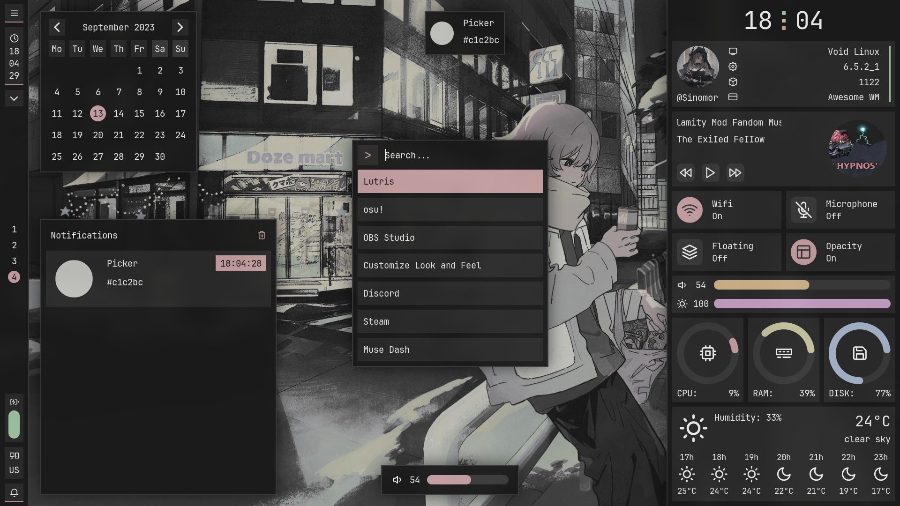

- Window Manager: [Awesome](https://github.com/awesomeWM/awesome)
- Terminal: [Alacritty](https://github.com/alacritty/alacritty)
- Font: [JetBrainsMono Nerd Font](https://www.nerdfonts.com/) 
- Visualizer: [Cava](https://github.com/karlstav/cava)

## Screenshots

## Special Thanks

- [Myagko](https://github.com/Myagko) *For help with configuring wm*

