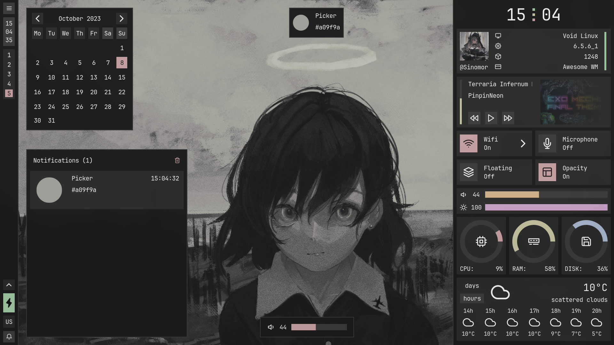
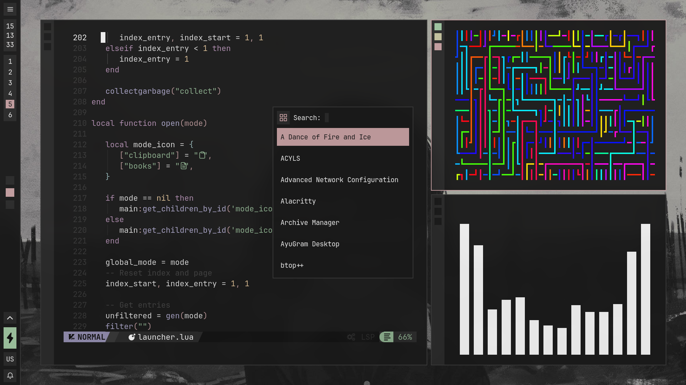
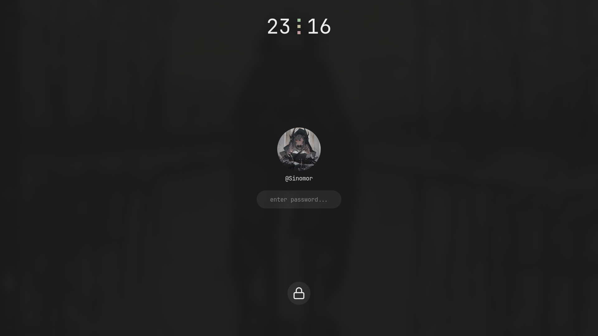
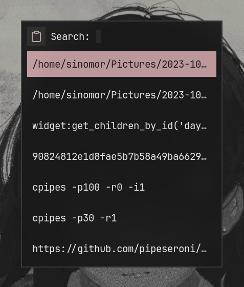

## Information
- OS: [Void](https://voidlinux.org)
- Window Manager: [Awesome](https://github.com/awesomeWM/awesome)
- Terminal: [Alacritty](https://github.com/alacritty/alacritty)
- Font: [JetBrainsMono Nerd](https://www.nerdfonts.com/) 
- Icons Font: [Feather](home/.fonts/)
- Visualizer: [Cava](https://github.com/karlstav/cava)

## Screenshots



<details>
<summary><b>Some Other Stuff</b></summary>
<br>

* lockscreen (liplua pam)


<br>

* clipboard (greenclip)


<br>

* books launcher (zathura)


</details>

## Setup

<details>
<summary><b>Install Dependencies</b></summary>
<br>

> Setup the void-packages repo

```bash
git clone --depth=1 https://github.com/void-linux/void-packages
cd void-packages
./xbps-src binary-bootstrap
echo XBPS_ALLOW_RESTRICTED=yes >> etc/conf
```

> Build the awesome package

```bash
git clone https://github.com/Sinomor/my-templates
mv my-templates/awesome-git srcpkgs/
./xbps-src pkg awesome-git
```

> Install the awesome package

```bash
sudo xbps-install xtools
xi awesome-git
```

<br>

> Install Other Dependencies

```bash
sudo xbps-install feh xclip gpick xrdb picom polkit-gnome fontconfig fontconfig-32bit ImageMagick zbar slop shotgun fish-shell playerctl brightnessctl
```

</details>

<details>
<summary><b>Install Dotfiles</b></summary>
<br>

> Recommended to backup the configs 

```bash
git clone --depth=1 --recursive https://github.com/Sinomor/dotfiles.git
cd dotfiles
cp -r home/.config/* ~/.config/
cp -r home/.fonts ~/
cp -r home/.icons ~/
cp -r home/.local/bin ~/.local
cp -r home/.themes ~/
cp home/.xinitrc ~/
cp home/.Xresources ~/
cp home/.gtkrc-2.0 ~/ 
```

> Write to awesome/config/key.lua (already exists) your password and apikey from openweather 
```lua
local M = {
  openweatherapi = "your_api_key",
  password = "your_password",
}

return M
```

</details>


## References

- [Myagko](https://github.com/Myagko/dotfiles)
- [Stardust-kyun](https://github.com/Stardust-kyun/dotfiles)
- [Saimoom](https://github.com/saimoomedits/dotfiles/tree/main)
